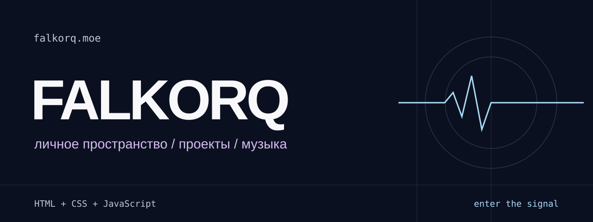

[](https://falkorq.moe/)

<p align="center">
  <a href="https://falkorq.moe/"><strong>Открыть сайт</strong></a> ·
  <a href="#локальный-запуск">Запустить локально</a> ·
  <a href="docs/DEVELOPMENT.md">Документация</a>
</p>

# falkorq.moe

Личное пространство Yui / Falkorq: сообщества, перевод манги, фотография, музыка и сетап. Глубокий синий фон, жемчужная типографика, ледяные голубые и лавандовые акценты — в палитре Vanilla из Nekopara.

## Внутри

- Полноэкранный первый экран, звёздный canvas-фон и появление секций при прокрутке.
- Проекты, сообщества и переводческая работа с LilithTeam.
- Отдельная секция Yuna со счётчиком дней.
- Последний прослушанный трек из stats.fm с локальным кэшем и запасным состоянием.
- Сетап, социальные ссылки и раздел поддержки с копированием реквизитов.
- Адаптивная навигация и поддержка уменьшенного движения.

## Без сборки

**HTML · CSS · JavaScript · Canvas · stats.fm**

Обычный статический сайт без фреймворков и npm-зависимостей. Шрифты хранятся в репозитории и подключаются через `@font-face`.

| Файл | Назначение |
| --- | --- |
| `index.html` | Секции и содержимое страницы |
| `style.css` | Основные стили, компоненты и адаптив |
| `personal.css` | Палитра Vanilla и персональное оформление |
| `fonts.css` | Локальные шрифты |
| `script.js` | Навигация, анимации, stats.fm и взаимодействия |
| `assets/` | Иллюстрации и файлы шрифтов с лицензиями |

## Локальный запуск

Из корня репозитория:

```sh
python -m http.server 8765
```

Открой [localhost:8765](http://localhost:8765/). Установка пакетов и сборка не нужны.

Настройки музыкального виджета, проверка изменений и публикация описаны в [документации разработки](docs/DEVELOPMENT.md).

---

[nyaaa.moe](https://nyaaa.moe/) — ещё один мой проект: кошачьи тесты, переводчик и кафе La Soleil.
